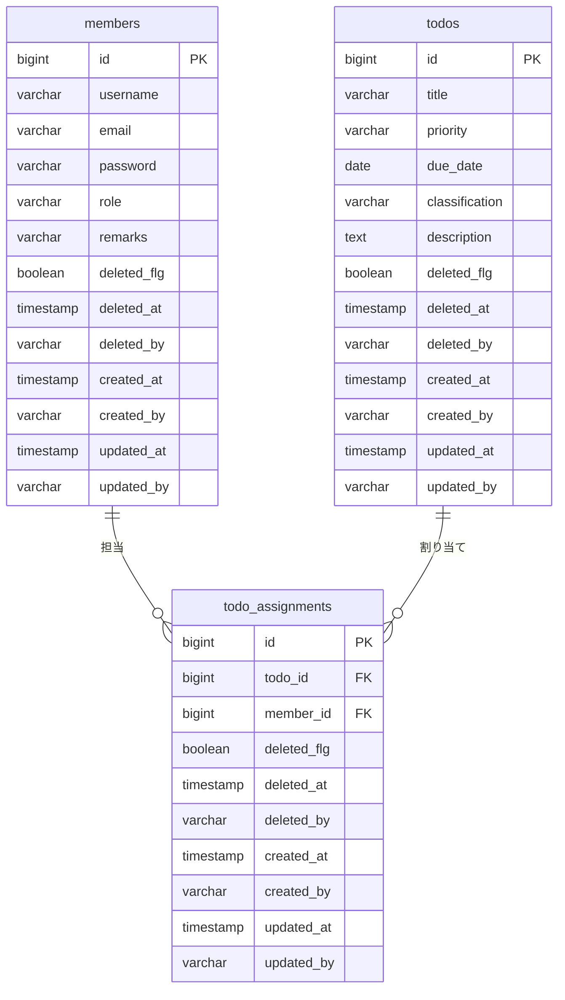
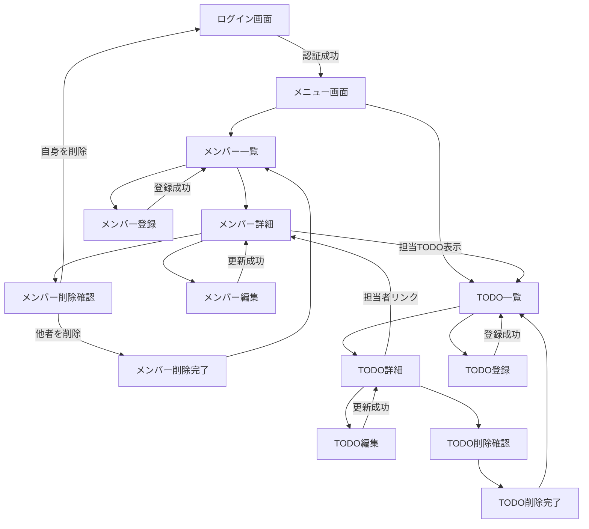

# 📋 メンバーTODO管理システム

> チーム内のメンバー管理とタスク管理を一元化する Web アプリケーション
> 
> 詳細は/docsにあります。


---

## 📖 目次

- [プロジェクト概要](#-プロジェクト概要)
- [主な機能](#-主な機能)
- [技術スタック](#-技術スタック)
- [システムアーキテクチャ](#-システムアーキテクチャ)
- [画面一覧](#-画面一覧)
- [ER図・データモデル](#-erデータモデル)
- [ロール・権限体系](#-ロール権限体系)
- [画面遷移図](#-画面遷移図)
- [セットアップ手順](#-セットアップ手順)
- [ディレクトリ構成](#-ディレクトリ構成)
- [工夫した点・アピールポイント](#-工夫した点アピールポイント)

---

## 🎯 プロジェクト概要

| 項目 | 内容 |
|---|---|
| **プロジェクト名** | todo-app |
| **グループ** | com.forgeon |
| **バージョン** | 0.0.1-SNAPSHOT |
| **開発期間** | 約2ヶ月（個人開発） |
| **種別** | チーム向けタスク管理 Web アプリケーション |

本アプリケーションは、チーム内のメンバー登録・権限管理と、TODO（タスク）の作成・担当者割り当て・進捗管理を提供するフルスタック Web アプリケーションです。  
Spring Security による認証・認可を実装し、3段階のロール（管理者 / TODO管理者 / メンバー）による細やかなアクセス制御を実現しています。

---

## ✨ 主な機能

### 🔐 認証・認可
- Spring Security によるフォームベース認証（BCrypt パスワードハッシュ）
- 3段階のロールベースアクセス制御（ADMIN / TODO_ADMIN / MEMBER）
- TODO 単位の編集権限制御（`@PreAuthorize` + カスタム権限判定）

### 👥 メンバー管理（CRUD）
- メンバー一覧表示（検索・ソート対応）
- メンバー登録 / 詳細表示 / 編集 / 論理削除
- ロールに応じた表示制御（パスワードハッシュの表示/非表示など）
- 自身のアカウント削除時の自動ログアウト処理

### ✅ TODO管理（CRUD）
- TODO 一覧表示（検索・ソート・担当者フィルター対応）
- TODO 登録 / 詳細表示 / 編集 / 論理削除
- 複数担当者のアサイン（チェックボックスによる多対多関連）
- 優先度（高/中/低）・分類（機能開発/バグ修正/リファクタ/テスト/ドキュメント/その他）管理

### 🔍 横断機能
- カラムごとの部分一致検索フィルター
- テーブルヘッダークリックによるソート（昇順/降順切り替え）
- Bean Validation によるサーバーサイドバリデーション
- 共通ヘッダー / フッター（Thymeleaf フラグメント）

---

## 🛠 技術スタック

| 分類 | 技術 | バージョン |
|---|---|---|
| **言語** | Java | 21 |
| **フレームワーク** | Spring Boot | 4.0.1 |
| **テンプレートエンジン** | Thymeleaf | 3系 |
| **認証・認可** | Spring Security | 6系 |
| **O/R マッパー** | MyBatis (mybatis-spring-boot-starter) | 4.0.1 |
| **データベース** | PostgreSQL | 16 |
| **DB マイグレーション** | Flyway | — |
| **バリデーション** | Bean Validation (Hibernate Validator) | — |
| **ビルドツール** | Gradle | — |
| **その他** | Lombok | — |

---

## 🏗 システムアーキテクチャ

MVC アーキテクチャに基づく 4 層レイヤー構成を採用しています。

```
┌─────────────────────────────────────────────────────┐
│                 ブラウザ (HTML/CSS/JS)                │
└──────────────────────┬──────────────────────────────┘
                       │ HTTP
┌──────────────────────▼──────────────────────────────┐
│  Presentation Layer                                  │
│  ├─ AuthViewController   (ログイン・メニュー)        │
│  ├─ MemberViewController (メンバーCRUD)              │
│  └─ TodoViewController   (TODO CRUD)                 │
├──────────────────────────────────────────────────────┤
│  Security Layer                                      │
│  ├─ SecurityConfig        (認証・認可設定)            │
│  ├─ CustomUserDetails     (ユーザー情報拡張)          │
│  ├─ TodoSecurity          (TODO編集権限判定)          │
│  └─ UserDetailsServiceImpl(認証ユーザー取得)          │
├──────────────────────────────────────────────────────┤
│  Business Layer                                      │
│  ├─ MemberService         (メンバー業務ロジック)      │
│  └─ TodoService           (TODO業務ロジック)          │
├──────────────────────────────────────────────────────┤
│  Data Access Layer                                   │
│  ├─ MemberMapper (.java + .xml)                      │
│  └─ TodoMapper   (.java + .xml)                      │
├──────────────────────────────────────────────────────┤
│  Database                                            │
│  └─ PostgreSQL (Flyway による自動マイグレーション)     │
└──────────────────────────────────────────────────────┘
```

---

## 🖥 画面一覧

全14画面で構成されています。

| # | 画面名 | URL | 説明 |
|---|---|---|---|
| 1 | ログイン | `/login` | ユーザー名・パスワードによるフォーム認証 |
| 2 | メニュー | `/menu` | メンバー一覧・TODO一覧へのナビゲーション |
| 3 | メンバー一覧 | `/members` | 全メンバーのリスト表示（検索・ソート対応） |
| 4 | メンバー登録 | `/members/add` | 新規メンバーの登録フォーム |
| 5 | メンバー詳細 | `/members/{id}` | メンバーの詳細情報表示 |
| 6 | メンバー編集 | `/members/edit/{id}` | メンバー情報の更新フォーム |
| 7 | メンバー削除確認 | `/members/delete/{id}` | 削除前の確認画面 |
| 8 | メンバー削除完了 | — | 削除成功メッセージ |
| 9 | TODO一覧 | `/todos` | 全TODOのリスト表示（検索・ソート対応） |
| 10 | TODO登録 | `/todos/add` | 新規TODOの登録フォーム |
| 11 | TODO詳細 | `/todos/{id}` | TODOの詳細情報表示 |
| 12 | TODO編集 | `/todos/edit/{id}` | TODO情報の更新フォーム |
| 13 | TODO削除確認 | `/todos/delete/{id}` | 削除前の確認画面 |
| 14 | TODO削除完了 | — | 削除成功メッセージ |

---

## 📊 ER図・データモデル



- 全テーブルに **論理削除** カラム（`deleted_flg`, `deleted_at`, `deleted_by`）を実装
- 全テーブルに **監査情報** カラム（`created_at/by`, `updated_at/by`）を実装
- `todo_assignments` は `members` ⇄ `todos` の **多対多** 関連を管理する中間テーブル

---

## 🔑 ロール・権限体系

3段階のロールによるきめ細かなアクセス制御を実装しています。

| ロール | メンバー編集 | メンバー削除 | TODO閲覧 | TODO編集/削除 |
|---|---|---|---|---|
| **ADMIN**（管理者） | ◯（全メンバー） | ◯（全メンバー） | ◯ | ◯（全TODO） |
| **TODO_ADMIN**（TODO管理者） | ◯（自分のみ） | ◯（自分のみ） | ◯ | ◯（全TODO） |
| **MEMBER**（メンバー） | ◯（自分のみ） | ◯（自分のみ） | ◯ | ◯（自分が担当のTODOのみ） |

> **権限判定ロジック**: `TodoSecurity.canEdit()` メソッドにて実装。ADMIN / TODO_ADMIN ロールは全TODOを編集可能。MEMBER ロールは自分がアサインされている TODO のみ編集・削除が可能。

---

## 🗺 画面遷移図



---

## 🚀 セットアップ手順

### 前提条件

- **Java** 21 以上
- **PostgreSQL** 16 以上
- **Gradle** 8 以上（Gradle Wrapper 同梱）

### 1. リポジトリのクローン

```bash
git clone https://github.com/your-username/todo-app.git
cd todo-app
```

### 2. データベースの作成

```sql
CREATE DATABASE todo_app_db;
CREATE USER root WITH PASSWORD 'your-password';
GRANT ALL PRIVILEGES ON DATABASE todo_app_db TO root;
```

### 3. アプリケーション設定

`src/main/resources/application.properties` を環境に合わせて編集してください。

```properties
spring.datasource.url=jdbc:postgresql://localhost:5432/todo_app_db
spring.datasource.username=root
spring.datasource.password=your-password
```

### 4. アプリケーションの起動

```bash
./gradlew bootRun
```

起動後、ブラウザで http://localhost:8080/login にアクセスしてください。

> **Note**: Flyway によりテーブル作成とサンプルデータの投入が自動的に行われます。

---

## 📁 ディレクトリ構成

```
todo-app/
├── src/main/
│   ├── java/com/forgeon/todo_app/
│   │   ├── TodoAppApplication.java           # エントリーポイント
│   │   ├── constant/
│   │   │   ├── Classification.java           # TODO分類 enum
│   │   │   ├── Priority.java                 # 優先度 enum
│   │   │   └── Role.java                     # 権限 enum
│   │   ├── controller/view/
│   │   │   ├── AuthViewController.java       # 認証画面コントローラー
│   │   │   ├── MemberViewController.java     # メンバー画面コントローラー
│   │   │   └── TodoViewController.java       # TODO画面コントローラー
│   │   ├── dto/
│   │   │   ├── MemberResponseDto.java        # メンバーレスポンスDTO
│   │   │   └── TodoResponseDto.java          # TODOレスポンスDTO
│   │   ├── entity/
│   │   │   ├── AbstractAudit.java            # 監査情報基底クラス
│   │   │   ├── Member.java                   # メンバーエンティティ
│   │   │   └── Todo.java                     # TODOエンティティ
│   │   ├── form/
│   │   │   ├── MemberForm.java               # メンバー入力フォーム
│   │   │   ├── MemberSearchForm.java         # メンバー検索フォーム
│   │   │   ├── TodoForm.java                 # TODO入力フォーム
│   │   │   └── TodoSearchForm.java           # TODO検索フォーム
│   │   ├── mapper/
│   │   │   ├── MemberMapper.java             # メンバーMapperインターフェース
│   │   │   └── TodoMapper.java               # TODOMapperインターフェース
│   │   ├── security/
│   │   │   ├── CustomUserDetails.java        # ユーザー情報拡張
│   │   │   ├── SecurityConfig.java           # セキュリティ設定
│   │   │   └── TodoSecurity.java             # TODO編集権限判定
│   │   └── service/
│   │       ├── MemberService.java            # メンバーサービス
│   │       ├── TodoService.java              # TODOサービス
│   │       └── UserDetailsServiceImpl.java   # 認証サービス
│   └── resources/
│       ├── application.properties            # アプリケーション設定
│       ├── db/migration/
│       │   ├── V1.0.0__create_tables.sql     # テーブル作成DDL
│       │   └── R__insert_sample_data.sql     # サンプルデータ（繰返し実行）
│       ├── mapper/
│       │   ├── MemberMapper.xml              # メンバーSQL定義
│       │   └── TodoMapper.xml                # TODO SQL定義
│       ├── static/
│       │   ├── css/                          # 各画面用CSS
│       │   └── js/main.js                    # ソート用JavaScript
│       └── templates/                        # Thymeleaf テンプレート（全14画面）
├── docs/                                     # 設計ドキュメント
├── build.gradle                              # ビルド設定
└── settings.gradle
```

---

## 💡 工夫した点・アピールポイント

### 1. セキュリティ設計
- Spring Security を活用した **3段階のロールベースアクセス制御**
- `@PreAuthorize` と カスタム `TodoSecurity` クラスによる **TODO単位のきめ細かな権限制御**
- パスワードの **BCrypt ハッシュ化** による安全な保存
- ロールに応じたパスワード表示の出し分け（ADMIN のみハッシュ値表示）

### 2. データ整合性
- **論理削除** の採用によりデータの追跡可能性を確保
- 全テーブルの **監査カラム**（作成者/更新者/作成日時/更新日時）
- `@Transactional` による TODO と担当者アサインの **一括トランザクション管理**

### 3. DB マイグレーション
- **Flyway** によるバージョン管理されたマイグレーション
- 繰り返し実行可能なサンプルデータスクリプトで開発効率を向上

### 4. ユーザビリティ
- 一覧画面のカラムごとの **検索フィルター**（部分一致検索）
- テーブルヘッダークリックによる **ソート機能**（昇順/降順切り替え）
- メンバー詳細画面から担当 TODO を直接フィルタリング表示
- TODO 詳細画面から担当者のメンバー詳細へのリンク

### 5. 保守性・拡張性
- **MVC + レイヤードアーキテクチャ** による責務の分離
- **MyBatis XML マッパー** による SQL の明示的管理
- **Enum 定数クラス**（Role / Priority / Classification）による型安全な値管理
- **DTO パターン** によるレイヤー間のデータ受け渡し

---

## 📄 ライセンス

このプロジェクトは学習・ポートフォリオ目的で作成されています。
